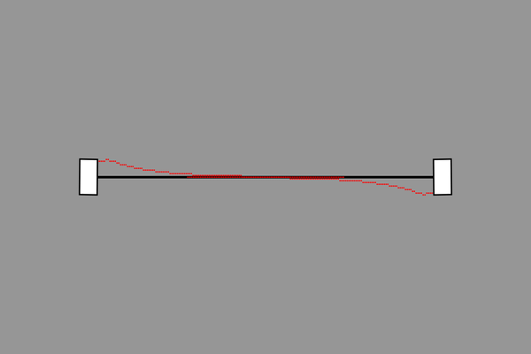

# Bezier Curves Tracking with Application in Mobile Robots

  

## Table of Contents
  - [1. Problem Statement](#1-problem-statement)
  - [2. Pursuit Curves](#2-pursuit-curves)
  - [3. Bezier Curves](#3-bezier-curves)
  - [4. Path Tracking](#4-path-tracking)
  - [5. Obstacle Avoidance](#5-obstacle-avoidance)
  - [6. Demo](#6-demo)
    - [6.1. Path Tracking](#61-path-tracking)
    - [6.2. Obstacle Avoidance](#62-obstacle-avoidance)
  - [7. Work-in-Progress and Future Work](#7-work-in-progress-and-future-work)

## 1. Problem Statement

In mobile robot applications, it is often the case that we already setup a network of roads for robots. The road network can be used as a graph for a graph-based search algorithm such as A*, which would find a feasible path for a robot to reach its destination. Now, the remaining problem is that:

* Given a predefined path for a robot to follow, how can we develop a path planner which can drive the robot to **approach** and **track** the path while respecting the robot's **turning radius** constraint?
* Since there might be objects that are blocking the path, how can the planner avoid these unexpected obstacles?

Therefore, this project is an attempt to create such a path planner for the above problems. 

## 2. Pursuit Curves
The path planner is inspired by the concept of [pursuit curve](https://en.wikipedia.org/wiki/Pursuit_curve), which is constructed by analogy to having a point(pursuer) pursuing another point(pursuee).

  

From the above animation, the black point is the pursuee, the red point is the purseer and the red curve is called a pursuit curve. The pursuee is minding its own business following a straight line, while the pursuer is trying to catch the pursuee by always pointing its velocity vector toward the pursuee. Regardless of intial position, the pursuer will eventually converge to the path of the pursuee. We can embed this behavior into our path planner by representing the **pursuer as our mobile robot** and the **pursuee as the ideal robot** that we want our robot to converge to. 

Howover, the dynamics of pursuit curve does not take into account the heading as well as the mininum turning radius of mobile robots, espectially for nonholonomic robots. This issue can be addressed by constraining the pursuer's instantaneous center of rotation (ICR) such that the radius would always be at least the robot's minimum turning radius. 

  

Assume that the robot is going at a constant velocity $v$, and we are working in discrete time environment with sampling time $T_s$. Therefore, the length of each segment is:

$$ L = v*T_s $$

The black segments represent the robot (pursuer)'s trajectory, and the arrows are the robot's velocity/heading directions. Given robot's current heading, $theta_{max}$ is the allowed range that the robot's velocity vector can deviate. 

$$ theta_{max} = \arctan({L \over R_{min}}) $$

Notice that the smaller the robot's mininum turning radius $R_{min}$, the larger the allowed maximum angle of deviation $theta_{max}$. 

Therefore, if the pursuer's velocity vector exceeds the maximum allowed deviation from its current heading, then we can just clamp the velocity vector at the max allowed direction. This will ensure the robot's minimum turning radius to be satisfied at all time. 

## 3. Bezier Curves
Now that a robot can asymptotically converge to its "ideal" version using the dynamics of pursuit curves. The next step is to formulate the path of the ideal robot. The path of the pursee (ideal robot) can be easily specfied using [Bezier curves](https://en.wikipedia.org/wiki/B%C3%A9zier_curve). In short, a Bezier curve is a smooth parametric curve which is defined by a set of control points. Points $P$ along a Bezier curve can be expressed by an equation of a parametric variable $\lambda$ and control points $P_0,P_1,...$ 

$$P = f(\lambda,P_0,P_1,...)$$

There are 3 common Bezier curves:

* Linear Bezier

  

$$P = (1-\lambda)P_0 + \lambda P_1$$
* Quadratic Bezier

  

$$P=(1-\lambda)^2P_0 + 2(1-\lambda)\lambda P_1 + \lambda^2 P_2$$
* Cubic Bezier 

  

$$P = (1-\lambda)^3 P_0 + 3(1-\lambda)^2\lambda P_1 + 3(1-\lambda)\lambda^2 P_2 + \lambda^3 P_3$$

By specifying the control points and combining Bezier curves piecewise, we can formulate any path for a robot to track. The only thing left is to ensure the pursuee is going at a desired speed:

 Since control points are already specfied, points along a Bezier curve now depend only on $\lambda$

 $$P = f(\lambda) = [P_x,P_y]^T$$

 Let $P_x = h(\lambda)$ and $P_y = k(\lambda)$

 $$ \dot{P_x} = \frac{dh}{d\lambda}*\dot{\lambda} $$
 
 $$ \dot{P_y} = \frac{dk}{d\lambda}*\dot{\lambda} $$

 Given we want the pursuee (ideal robot) to have a velocity $V$

 $$ V^2 = \dot{P_x}^2 + \dot{P_y}^2 = (\frac{dh}{d\lambda}^2 + \frac{dk}{d\lambda}^2)*\dot{\lambda}^2$$

 $$ \dot{\lambda} = \sqrt{\frac{V^2}{\frac{dh}{d\lambda}^2 + \frac{dk}{d\lambda}^2}} $$

Using the above equation, we can always determine $\dot{\lambda}$ at any given $\lambda$ such that the ideal robot maintains a desired velocity $V$. Additionally, after $\dot{\lambda}$ is known, we can also find the heading direction of the ideal robot by calculating $[\dot{P_x} , \dot{P_x}]^T$. This heading direction will be very useful  in the next section. 

## 4. Path Tracking
Section 2 helps us to embed the dynamics of pursuit curves so that our robot can converge to a target path. Section 3 enables us to formally specify any path for the robot to follow using piecewise Bezier curves. Notice that given the current pose of the pursuer (our robot), the starting position of the pursuee (ideal robot) will definitely have an impact on the trajectory of the pursuer. 

For example, says that the pursuer (red) is initially at point [0,1], and we want the pursuer to approach a line passing through points [-1,0] & [1,0] and head toward the right. Then, we know the pursuee (black) needs to go from left to right, but what should the starting position of the pursuee be? If the pursuee starts at far left, then the pursuer will first approach the line toward the left and, at some point, make almost a 180 degrees turn to catch up with the pursuee which is heading toward the right.  

  

On the other hand, If the pursuee starts at far right, then the pursuer will converge to the target path at the correct heading. However, the rate at which the pursuer sufficiently converges might be slow.  

  

Therefore, we know that a good starting position of the pursuee is somewhere to the right near the middle.

  

As a result, the goal of the path planner is to find a good starting position of the pursuee so that the pursuer can quickly converge to the target path while having the correct heading. Now, the path planning problem becomes a one-dimensional search problem where the goal is to find a good starting $\lambda$ along the target piecewise Bezier curves. For this search problem, a **numerical gradient descent based method** would be good enough, and the cost function needs to consider the followings:

* Distance between pursuer and pursuee.
* Heading difference between pursuer and pursuee.
* Smoothness in pursuer's trajectory.

To evaluate the pursuer's trajectory against the cost function for a given $\lambda$, we need to:

* Find the correspond starting position of pursuee along target piecewise Bezier curves.
* Move the pursuee at the appropriate $\dot{\lambda}$ so that pursee is moving at a desired speed.
* Numerically generate pursuer's trajectory using the dynamics of pursuit curves.
* Calculate and accumulate the cost for each point along the pursuer's trajectory. 

After the planner converges to a good trajectory, the pursuer's velocity vector $[v_x,v_y]$ at the first timestep can be applied to our robot, and the entire process is then repeated for the new position of the robot. In other words, the path planner would behave like a [MPC](https://en.wikipedia.org/wiki/Model_predictive_control) controller, but instead of solving for an optimization problem, the planner is numerically rolling out trajectories using the dynamics of pursuit curves. 

## 5. Obstacle Avoidance
Obstacle avoidance can be integrated using [dynamics modulation](https://github.com/TuanMinhNguyen15/Reactive-Trajectory-Planning-for-Obstacle-Avoidance), which is an reactive approach. In dynamics modulation, robot's velocity vector ($v$) is broken down into 2 components; one points gradiently toward to an obstacle ($v_n$), and the other points perpendicularly away ($v_e$).

  

As robot gets closer to the obstacle, $v_n$ will be scaled down, and $v_e$ will be modified such that the magnitude of the new velocity vector would maintain $|v|$. Consequencely, at the obstacle's boundary, $|v_n| = 0$ and $|v_e| = |v|$

Of course, we still need to ensure the robot's minimum turning radius is satisfy at all time, which is discussed in Section 2.

## 6. Demo
### 6.1. Path Tracking
In this demo, a mobile robot needs to track a stair-like path. The goal is NOT to reach an end point, but to drive the robot to quickly converge and make progress along the path. 

In the first scenario, the robot is intially on the path and heading toward the correct direction. Notice that at the 90-degrees turns, the robot always satify its minimum turning radius, which is set to $0.1$

  

In the next 3 scenarios, the robot is NOT placed on the path and is initially headed in the wrong direction. The path planner successfully drives the robot to smoothly approach the target path.

  

  

  

### 6.2. Obstacle Avoidance

  

  

### 6.3. Multi-agents

  

## 7. Work-in-Progress and Future Work
Currently, only linear bezier is implemented which, I believe, is enough to construct most paths in mobile robot applications. Quadratic and cubic Bezier curves are in progress. 

In the future, I plan to incorporate obstacle avoidance into the planner using [dynamics modulation](https://github.com/TuanMinhNguyen15/Reactive-Trajectory-Planning-for-Obstacle-Avoidance). However, since a robot might has a minimum turning radius constraint, I concern that dynamics modulation might not guarantee a collision-free path. Therefore, more investigations are needed. 